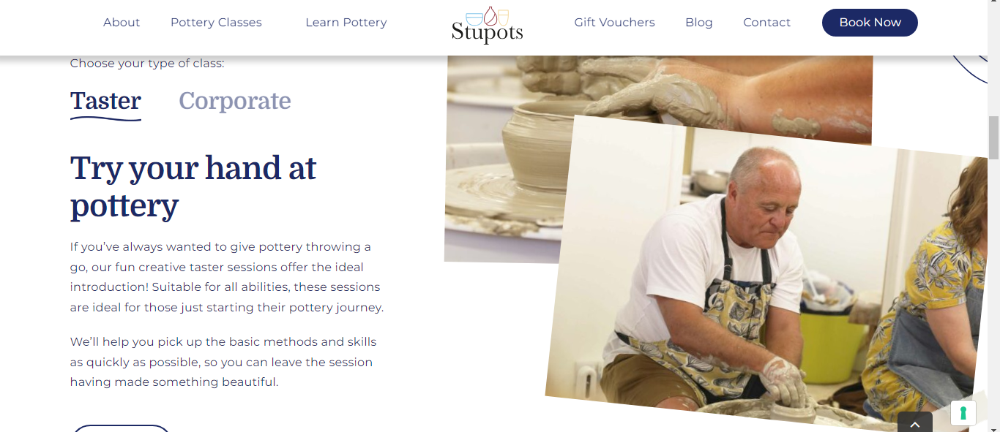
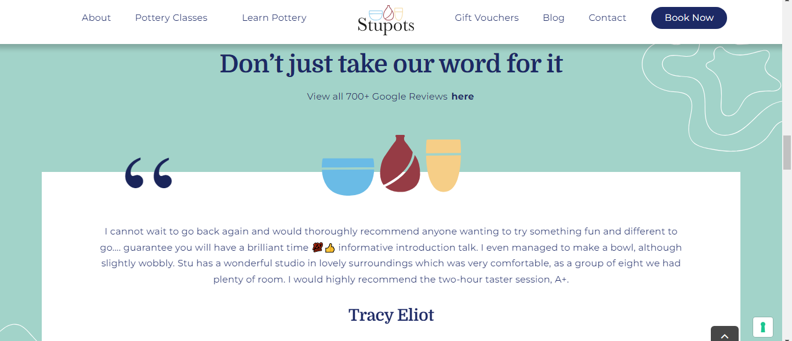

# South Wales Pottery Club - Competitor Review

## Cardiff Pottery Workshops 

 [Cardiff Pottery Workshops](https://www.cardiffpotteryworkshops.com) are a successful business based in Cardiff. They have  wide range of classes and membership options available including lessons, studio space for rent and social evenings.
 
  Although very informative, the website is not the most intuitive and seems to lack responsiveness when viewed on a larger screen. There is a lot of empty space when you first navigate to the home page and the menu sits in the middle of the screen, it not immediately obvious that there is more content on the page. The navigation menu is a long list of things they offer in no particular order which may cause issues with users not being able to find the appropriate content quickly. 

 Further down, they have links to different pages within the about section. These link to new pages with class descriptions, however on testing a number of the links don't work. Presenting the class descriptions in this way makes it quite challenging for the user, as it relies on them scrolling down to the appropriate section, reading the about section where you would not intuituvely look for class information, and then unable to find the information with broken links. 

The contact page doesn't respond to being on a larger screen, while not unusable it doesn't create the best UX experience as the input boxes seem disproportionately large for the amount of content they are designed to contain.

Lastly, the booking system is quite sporadic. Rather than having a dedicated booking section they have hidden the booking forms within the individual class pages. The personal tuition is at the bottom of the throwing classes page, which would not be where a user is likely to look for it.

While the site is comprehensive and contains a lot of useful information, it could be made more user friendly by better organising the information into relevant categories. Having a dedicated classes and booking page would rectify some of the navigation problems, while addressing some of the responsiveness issues would improve the user experience. 

## Peggy's Pots

[Peggy's Pots](https://www.peggyspots.co.uk/Default.aspx) is another successful business based in Cardiff. They offer pottery painting experiences and parties for people of all ages, especially catering for families.

The website is easier to navigate than the Cardiff Pottery Workshop but could also be improved upon. The navigation menu again is quite a long list that could be better organised into categories and sits below the logo.

They have included a classes section on the home page, providing a clear overview of the different class types. Clicking on these leads to a dedicated class page with descriptions and what to expect. Further down they have testimonials, the subscribe form and address all sitting within the footer. There seems to be an issue with the form size making a lot of empty space next to it. The form could perhaps be moved to another section to avoid this. 

The site has been designed with Bootstrap so seems to avoid any issues with resizing, and in fact looks better on a smaller screen as there is less blank space. The contact and booking pages contain lots of information, while useful it is possibly too much text which could be moved elsewhere or edited. These pages could also potenially benefit from some adjustments to the layout as the containers seem to sit randomly across the screen on a larger screen. Overall it is a good basic site which is relatively easy to navigate, however it could be made more user friendly with some tweaking to the design and layout. 

## Stupots 

[Stupots](https://www.stupots.co.uk/) is a pottery workshop based in Bristol. They offer a wide range of classes and experiences including corporate team building sessions.

The website is really nicely laid out and responsive. The navigation is organised into relevant categories and the logo sits nicely within the menu without being too big. They have used a video in place of a hero image on the home page which creates a welcoming experience. They have added a modal advising on extra spaces available in the taster sessions on the right of the screen which is a bit detrimental to the video, but does grab your attention. 

As you scroll down there is information on the highlighted experiences that they offer, testimonials, a scrolling gallery incorporating Javascript and finally a large footer which contains a lot of information inluding the address and contact information. It is well presented with interesting graphics, the layouts include images and descriptions defined into sections by different background colours and the descriptions are comprehensive without being too long. Each section includes a link to a dedicated page with more information encouraging clicks.

The booking and contact pages are also well laid out with well proportioned containers and are clean without too much information. The site is responsive and works well on both large and small screens. They've used a number of frameworks including Yoast SEO and seems to have been built on Wordpress. Overall this is a really user friendly website that looks professional and stands out as a good example from the research for this project.

