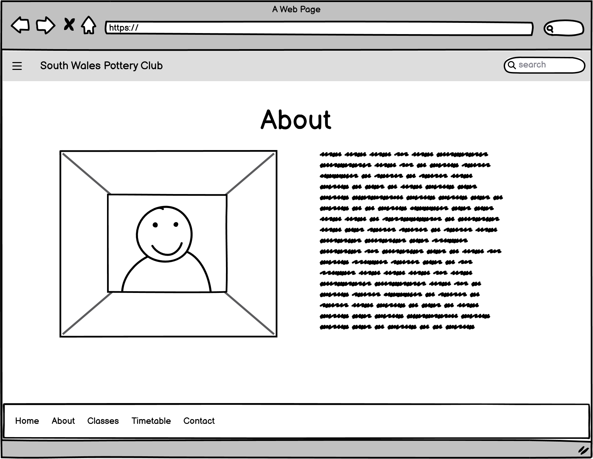
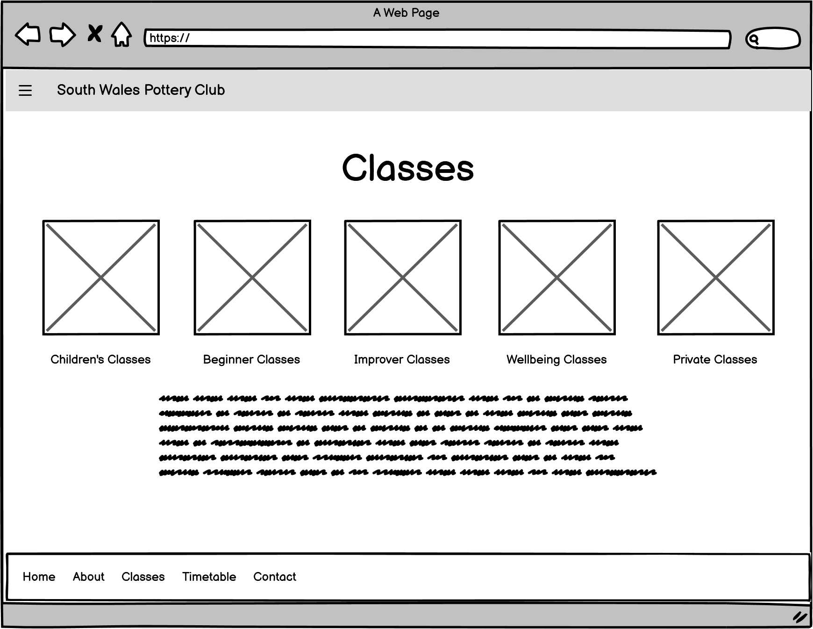
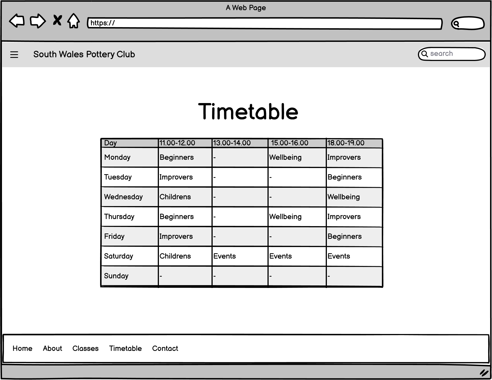

# South Wales Pottery Club

## UX

### Project Goals

* The goal of this project is to create a user-centric web site for an up and coming pottery business in South Wales.

### User Goals

Users of the site will be able to:

* Browse different classes and events
* Find class and event timetables
* Find the location of the classes
* Find contact information for the business
* View gallery of events and work
* View information on the benefits of pottery for wellbeing

### Business Goals

* To attract customers and build membership

### User Stories

* User 1 is looking for new activities to do with the kids over the school holidays

* User 2 is looking for a new hobby and the opportunity to make new friends

* User 3 is an intermediate potter looking to improve their skills

* User 4 is looking for fun new date night ideas

* User 5 is looking for a unique experience gift for a loved one

* User 6 was referred by the local mental health team

### Wireframes

Sitemap

Home Page

About Page

Classes Page

Gallery Page

Timetable Page

Contact Page

## Features

### Current Features

* Home page with hero image
* Navitagion to:
  * About section
  * Classes
  * Gallery
  * Timetable
  * Contact
* Class sub navigation:
  * Children's classes page
  * Adult's begginner classes page
  * Adult's improver classes page
  * Wellbeing classes page
  * Events page
  
### Future Features

* Book classes online
* Purchase memberships online
* Create an online shop to sell student's work

## Technologies Used

* HTML
* CSS
* Git
* Github
* Codeanywhere/VS code
* Bootstrap
* Balsamiq
* Google Fonts
* Font Awesome
* GIMP

## Testing
03/01/23 - All social links working

## Known Bugs

## Deployment

### How to run project locally

## Credits

### Content

### Media

background image <https://www.pexels.com/photo/person-holding-wooden-rolling-pin-7559748/>
Pot painting https://pixabay.com/photos/hand-art-pot-master-man-handmade-5441435/
House https://pixabay.com/photos/country-house-villa-ingrown-lonely-5019947/
Mum and Son https://www.freepik.com/free-photo/mother-with-son-pottery-class_10705274.htm#query=pottery%20class&position=47&from_view=search&track=ais&uuid=15eefbbd-5591-44f1-a7ae-5bea9a06561a
Children https://www.freepik.com/free-photo/brothers-pottery-class-together_10703805.htm#query=pottery%20class&position=37&from_view=search&track=ais&uuid=15eefbbd-5591-44f1-a7ae-5bea9a06561a
Couple https://www.freepik.com/free-photo/mutual-creative-work-adult-elegant-couple-casual-clothes-aprons-people-creating-bowl-pottery-wheel-clay-studio_10164980.htm#query=pottery%20class%20couples&position=48&from_view=search&track=ais&uuid=b3ad02d6-f0d1-41af-a080-5162b03a9e45
Pots on shelf https://www.pexels.com/photo/pottery-on-a-wall-shelf-6615807/
Workshop https://www.pexels.com/photo/photo-of-ceramic-kitchenware-on-shelves-3094041/
Plant pot https://www.pexels.com/photo/photo-of-ceramic-kitchenware-on-shelves-3094041/
Studio https://www.pexels.com/photo/couple-creative-working-indoors-9733232/
Cactus https://www.freepik.com/free-photo/still-life-with-cactus-plant_44590359.htm#query=website%20background%20pots&position=14&from_view=search&track=ais&uuid=5241e72f-f9bc-465d-915b-89e26216952c
Plate https://www.freepik.com/free-photo/top-view-brown-plate-empty-light-blue-plate-food_10543301.htm#page=3&query=Website%20background%20pottery&position=21&from_view=search&track=ais&uuid=a6dbcc91-eeb2-4210-b3a3-0a365894d206
### Code

### Acknowledgements

Responsive background images with Bootstrap 5
<https://www.youtube.com/watch?v=W87XNjvXiWw&t=178s>

Bootstrap Navbar
https://getbootstrap.com/docs/4.0/components/navbar/
