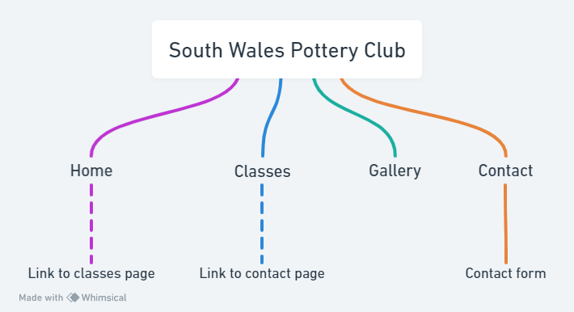
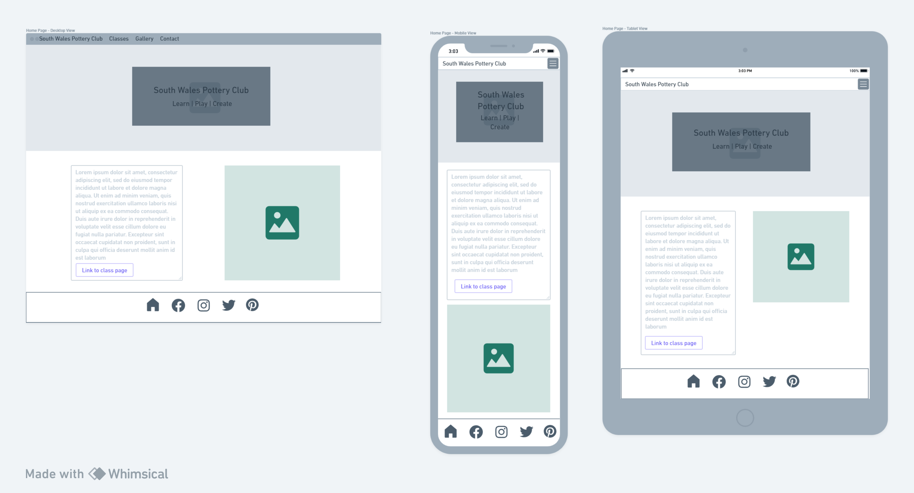
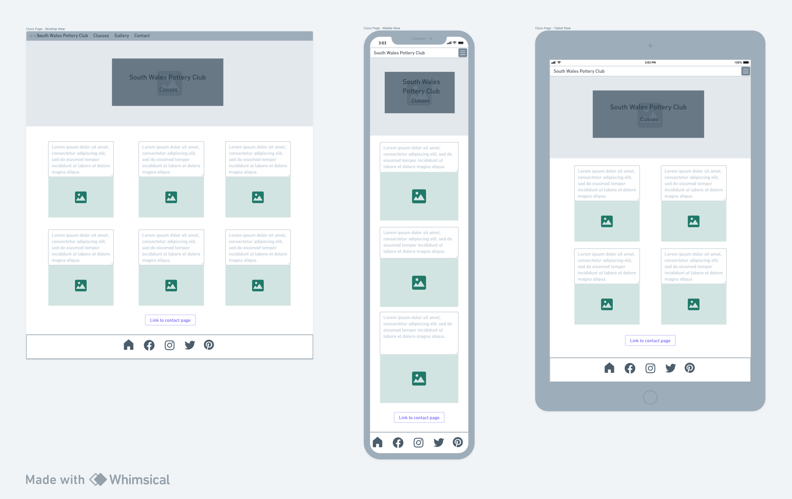
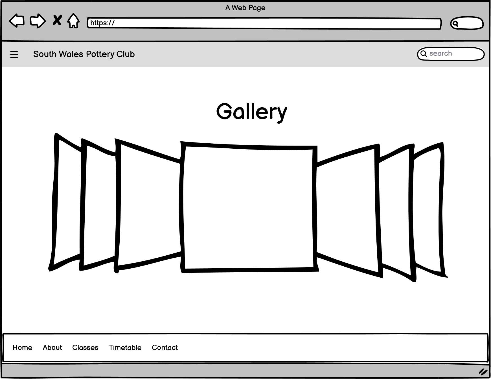
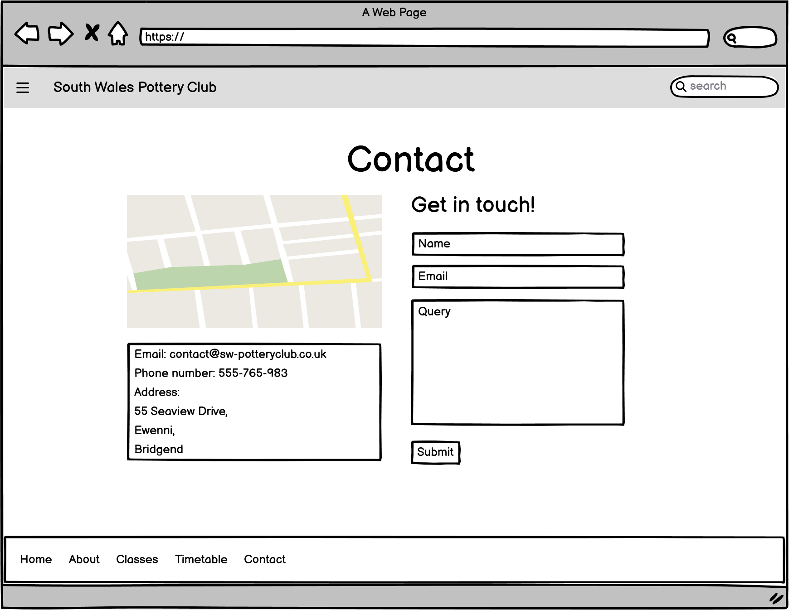
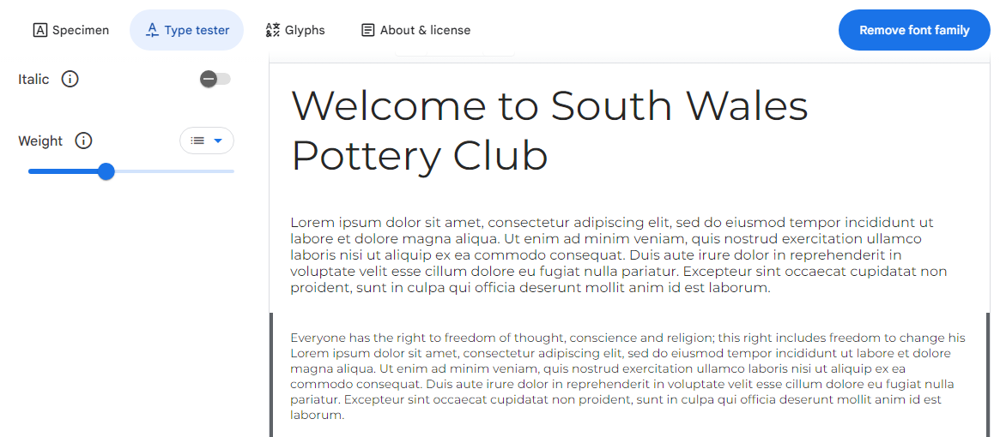

# South Wales Pottery Club

This is the website for South Wales Pottery Club, a hypothetical business in development. The site is the outcome of the Code Institute's milestone project one and designed primarily using html & CSS. Please find a link to the deployed project here:

[South Wales Pottery Club](https://annabelle-metcalfe.github.io/south-wales-pottery-club/index.html)

## Contents
- [UX - Strategy](#ux---strategy)
  * [Project Goals](#project-goals)
  * [Competitor Review](#competitor-review)
  * [User Stories](#user-stories)
- [UX - Scope](#ux---scope)
  * [Limitations Identified](#limitations-identified)
- [UX - Structure](#ux---structure)
  * [Sitemap](#sitemap)
- [UX - Skeleton](#ux---skeleton-plane)
  * [Wireframes](#wirerames)
- [UX - Surface](#ux---surface-plane)
  * [Design Choices](#design-choices)
   * [Colour Palette](#colour-pallette)
   * [Typography](#typography)
   * [Imagery](#imagery)
  * [Features](#features)
  * [Future Features](#future-features)
- [Testing](#testing)
- [Deployment](#deployment)
- [Technologies Used](#technologies-used)
- [Credits](#credits)
- [Acknowledgements](#acknowledgements)

## UX - Strategy 
### Project Goals

The goal of this project is to create a static user-centric website for an up and coming pottery class business in South Wales. The business has not yet begun trading so at this time they are looking to establish an online presence ahead of their launch. To achieve this, the project will evaluate similar businesses and impliment effective UX principles. The site will be cleanly presented, easy to navigate, encourage enquires through clickable links and viewable on all devices.

### Competitor Review

Please see details of the competitor research conducted [here](/COMPETITOR-REVIEW.md).

### User Stories

* Charles is looking for a new hobby and is considering trying a pottery class so would like to find out if there are any in his area.

* Emma is looking for new activities for her children and would like to find out class timetables.

* Bronwen has been doing some pottery for some time and is looking for a new studio space, she would like to enquire about long term membership.

* Michelle is looking for a unique experience gift and would like some more information on how to book.

* Graham was referred by the local mental health team and is anxious about joining so would like to see photos of the studio before enquiring.

### Business Goals

* Create an online presence for the business
* Attract customers and build membership
* Build a social media following

### User Goals

* Browse information on different classes
* Find a timetable for the classes
* Find the location of the studio
* Find contact information for the business
* View a gallery of the studio in action
* View the site on mobile devices
* Follow the business on social media

## UX - Scope

### Limitations Identified 

It is not possible to implement all desired features at this stage for a number of reasons. The contact form will not be linked to a database without back-end development, and the gallery will be static as there will be no Javascript. There will also be limited pages due to time contraints and the assesment criteria required for the project.

I have used Bootstrap to enable a responsive menu in the design but chosen to limit the use of this framework in other areas of the site. The reason for this decision is that I wished to have a good understanding of CSS and did not want to always be reliant on Bootstrap to help with responsiveness. The outcome of this has been learning to 
successfully impliment CSS grids for layouts and media queries to enable responsiveness.

## UX - Structure

### Sitemap

**Navigation**

My initial plan was to create a dedicated classes page with further links to individual classes. However, after discussing this with my mentor it was decided at this stage to focus on a single class page. In the future, if I was to develop this site further I would revisit this plan, create dedicated class pages and add more detail to the class descriptions. I would also look again at creating an events page which would be periodically updated by the business and add a booking system. Please note I used Balsamiq to create the first wireframe drafts and then moved over to Whimsical which is why the format is so different.

The first draft wireframes can be viewed [here](/FD-WIREFRAMES.md).

## UX - Skeleton

### Wireframes

**Home Page**

Initially I planned to just have a hero image on the landing page with some information on the studio. Users would of had to use the navigation menu to access any other parts of the site. The revised version is much more user friendly and includes links to other pages directly from the about section.

**Classes Page**

In the first draft I intended to have a landing page for all the classes and then a dedicated page for each class. After discussing this with my mentor I decided to streamline the design to incorporate one classes page with short class descriptions. In the future if I was to develop this site further I would revisit the seperate class pages and include more detailed class descriptions.

**Gallery Page**

Initially I has planned to use Bootstrap to create the gallery which would of enabled the use of Javascript and provided more options with interactitvity. However as I moved away from Bootstrap I needed to find another solution and used CSS grids to create a static gallery.

**Contact Page**

The contact page did not change an awful lot compared to the first draft, except I decided to include a timetable as well as the other components. I had some trouble with the layout which meant the timetable eventually had to go at the bottom of the page, I will discuss this further in the resolved bugs section.

## UX - Surface

### Design Choices 

#### Colour Pallette

Pottery is a relaxing and slow-paced activity so I chose to keep the colour palette neutral to ensure that none of the elements would be overpowering and to create a calm aesthetic. 

#### Typography

The font for the website is **Montserrat**, generated by Google Fonts. This was chosen due to being a clean contemporary font that gives the document a touch of sophistication. It is clear and easy to read without compromising on style.

#### Imagery 

I chose to use a hero image on each page to keep the format consistent across the site. The exception is the gallery page, as I felt including a hero image would be unneccessary and possibly interfere with the user experience. 

All images used in the site are free stock photos, sitation is available in the [credits](#credits) section.

## Features

### General

**Navbar**

The navigation menu consists of four relevant pages and is built with Bootstrap to enable responsiveness when viewed on small screens. I used Bootstrap's `navbar-brand` in place of a logo, which would be changed at a later date if I was to develop this site further. I used CSS to apply a darker font and make the `hover` effect slightly darker as the default did not provide enough contrast.

**Footer**

Initially I had styled the footer in the same way as the navbar but decided to change it so that it stands out better against the background when scrolling. I chose to use the sticky property on the footer as it creates a positive UX experience. The icons are generated by Font Awesome and all have relevant aria-labels to ensure accessibility for all users.

**Hero Text**

I have used the same format hero text across all the pages bar the gallery page. I followed a [tutorial](https://www.youtube.com/watch?v=W87XNjvXiWw&t=178s) to enable the text and hero image to sit in the right area.

### Home Page 

At first I was planning to use an image as a link to the classes page but since learned this isn't great for accessibility thanks to my mentor. The plan then evolved to encorporate the about section on the home page rather than having a dedicated about page. This makes the landing page more user friendly and takes away the need for excess pages.

I changed the image to the picture of a house to depict the studio and included some text about the business. I then added the link to the classes page at the bottom of the about section in the style of a button and also included a link within the text to the contact page to encourage clicks through to other pages.

It didn't seem like there was a whole lot on this page so I decided to add some testimonials. It made sense from a UX perspective to include them on the landing page where users would be very likely to see them.

### Classes Page

The classes page contains six key class types identified through competitor review. Each class has a relevant image and a short description. I used images which promote an emotional response such as people working together as this would help users get a feel for the atmosphere at the studio. At the bottom of this page there is a link to the contact page to encourage user engagement. 

### Gallery Page

This page contains a static gallery built with CSS grids. I did not include a hero image or title on this page as it seemed unneccessary and would interfere with the intended UX of the page.

### Contact Page

The contact page features all the relevant information a user might need to get in touch with the business and find the studio. There is a contact form, address, phone number, email address, google map and a timetable.

### 404 Page

Finally, I added a 404 page in case of errors. I chose a picture of a broken plate as it is quite humorous and relates back to the theme of pottery. I used Canva to adjust the colours.

### Future Features

* Add individual class pages and more detailed descriptions
* Add functionality to enable booking classes online
* Add an option to purchase memberships online
* Create an online shop to sell student's work
* Update the gallery and/or testimonials to make them more interactive

## Testing

The website has been tested on the following devices:
* Asus laptop running Windows 10
* Samsung Gallaxy S22
* Iphone 14
* Ipad 7th Gen

All the testing documentation can be found [here](/TESTING.md).

## Technologies Used

* HTML
* CSS
* Git
* Github
* Codeanywhere/VS code/Gitpod
* Bootstrap
* Balsamiq
* Google Fonts
* Font Awesome
* GIMP

## Deployment

### The site is deployed using GitHub Pages - South Wales Pottery Club

To Deploy the site using GitHub Pages:

1. Login (or signup) to Github.
2. Go to the repository for this project, Annabelle-Metcalfe/south-wales-pottery-club
3. Click on the settings button.
4. Select pages in the left hand navigation menu.
5. From the source dropdown select main branch and click save.
6. The site should now been deployed, please note that it may take a few minutes for the site to go live.

### How to run project locally

#### Local Development

How to Fork

To fork the repository:
1. Log in (or sign up) to Github.
2. Go to the repository for this project, Annabelle-Metcalfe/south-wales-pottery-club
3. Click the Fork button in the top right corner.

#### How to Clone

To clone the repository:
1. Log in (or sign up) to GitHub.
2. Go to the repository for this project, Annabelle-Metcalfe/south-wales-pottery-club
3. Click on the code button, select whether you would like to clone with HTTPS, SSH or GitHub CLI and copy the link shown.
4. Open the terminal in your code editor and change the current working directory to the location you want to use for the cloned directory.
5. Type 'git clone' into the terminal and then paste the link you copied in step 3. Press enter.

## Credits

### Content

* All the placeholder text featured in the site was written by myself.

* [Am I Responsive](https://ui.dev/amiresponsive) was used to generate the site overview images.

* [Kera Cudmore Readme Examples](https://github.com/kera-cudmore/readme-examples) gratefully provided the structure of the deployment steps.

### Media

[Google Maps](https://www.google.com/maps/embed?pb=!1m18!1m12!1m3!1d19876.57543532705!2d-3.6157785047719218!3d51.4843713332673!2m3!1f0!2f0!3f0!3m2!1i1024!2i768!4f13.1!3m3!1m2!1s0x486e6da60f85f263%3A0x50d8b23d4977cb0!2sEwenny%2C%20Bridgend%20CF35%205BL!5e0!3m2!1sen!2suk!4v1704639927687!5m2!1sen!2suk) provided the map on the contact page.

Images

Many thanks to all the creators of the free stock images used to create this website. Links to the source for each image are available below:  
[Background Image Main](https://www.pexels.com/photo/person-holding-wooden-rolling-pin-7559748/) |
[Pot painting](https://pixabay.com/photos/hand-art-pot-master-man-handmade-5441435/) |
[Country house](https://pixabay.com/photos/country-house-villa-ingrown-lonely-5019947/) |
[Mum and Son](https://www.freepik.com/free-photo/mother-with-son-pottery-class_10705274.htm#query=pottery%20class&position=47&from_view=search&track=ais&uuid=15eefbbd-5591-44f1-a7ae-5bea9a06561a) |
[Children](https://www.freepik.com/free-photo/brothers-pottery-class-together_10703805.htm#query=pottery%20class&position=37&from_view=search&track=ais&uuid=15eefbbd-5591-44f1-a7ae-5bea9a06561a) |
[Couple](https://www.freepik.com/free-photo/mutual-creative-work-adult-elegant-couple-casual-clothes-aprons-people-creating-bowl-pottery-wheel-clay-studio_10164980.htm#query=pottery%20class%20couples&position=48&from_view=search&track=ais&uuid=b3ad02d6-f0d1-41af-a080-5162b03a9e45) |
[Pots on shelf](https://www.pexels.com/photo/pottery-on-a-wall-shelf-6615807/) |
[Workshop](https://www.pexels.com/photo/photo-of-ceramic-kitchenware-on-shelves-3094041/) |
[Plant pot](https://www.pexels.com/photo/photo-of-ceramic-kitchenware-on-shelves-3094041/) |
[Studio Class](https://www.pexels.com/photo/couple-creative-working-indoors-9733232/) |
[Cactus](https://www.freepik.com/free-photo/still-life-with-cactus-plant_44590359.htm#query=website%20background%20pots&position=14&from_view=search&track=ais&uuid=5241e72f-f9bc-465d-915b-89e26216952c) |
[Plate](https://www.freepik.com/free-photo/top-view-brown-plate-empty-light-blue-plate-food_10543301.htm#page=3&query=Website%20background%20pottery&position=21&from_view=search&track=ais&uuid=a6dbcc91-eeb2-4210-b3a3-0a365894d206) |
[Multi-coloured](https://pixabay.com/users/hans-2/?utm_source=link-attribution&utm_medium=referral&utm_campaign=image&utm_content=9367) |
[White jugs](https://pixabay.com/users/noname_13-2364555/?utm_source=link-attribution&utm_medium=referral&utm_campaign=image&utm_content=4465357) |
[Hanging Mugs](https://pixabay.com/users/publicdomainpictures-14/?utm_source=link-attribution&utm_medium=referral&utm_campaign=image&utm_content=21905) |
[Lady Sculpture](https://pixabay.com/users/disappearingdiamonds-3977653/?utm_source=link-attribution&utm_medium=referral&utm_campaign=image&utm_content=3394318) |
[Cats](https://pixabay.com/users/leoleobobeo-1487549/?utm_source=link-attribution&utm_medium=referral&utm_campaign=image&utm_content=2759936) |
[Student](https://www.pexels.com/photo/pottery-making-classes-15096491/) |
[Child](https://www.pexels.com/photo/girl-in-art-class-3965526/) |
[Happy pot](https://www.pexels.com/photo/green-leafy-plant-potted-on-clay-pot-993626/) |
[Men in Studio](https://www.freepik.com/free-photo/side-view-man-doing-pottery_31124478.htm#query=pottery%20class&position=7&from_view=keyword&track=ais&uuid=8218caed-1a9f-4aae-88af-c016115a128) |
[Random pots](https://www.freepik.com/free-photo/various-ceramic-vases-with-paint-pottery-concept_10267527.htm#page=3&query=ceramics%20colourful&position=33&from_view=search&track=ais&uuid=87aa8cf3-c79b-4126-bf35-7f4bef18996a) |
[Broken Plate](https://unsplash.com/photos/top-view-photography-of-broken-ceramic-plate-cGXdjyP6-NU)

### Code

Further thanks and deep gratitude to the creators of the extremely informative tutorials which helped to build this site. Also to the creators of Bootstrap for providing the framework for the Navbar used in this site. Links to these resources can be found here:  

[Rounded corners tutorial](https://unused-css.com/blog/css-rounded-table-corners/#:~:text=If%20you%20are%20only%20rounding,done%20with%20a%20box%2Dshadow%20.)

[Responsive background images with Bootstrap 5 tutorial](https://www.youtube.com/watch?v=W87XNjvXiWw&t=178s)

[Autofit CSS grids tutorial](https://www.youtube.com/watch?v=QO-vcJFRgOg)

[Image gallery with CSS grids tutorial](https://www.freecodecamp.org/news/how-to-create-an-image-gallery-with-css-grid-e0f0fd666a5c/)

[Bootstrap Navbar](https://getbootstrap.com/docs/4.0/components/navbar/)

## Acknowledgements

Particular thanks to my mentor [Luke Buchanan](https://github.com/luke-buchanan) for guiding me through this project and to all CI staff and fellow students for their input both on Slack and in our weekly standups.