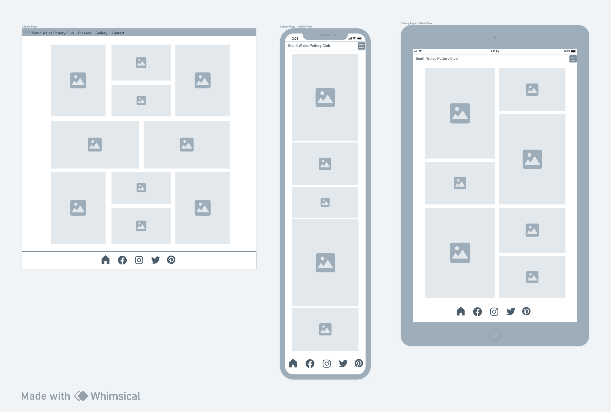

# South Wales Pottery Club

This is the website for South Wales Pottery Club, a hypothetical business in development. The site is the outcome of the Code Institute's milestone project one and designed primarily using html & CSS. Please find a link to the deployed project here:

[South Wales Pottery Club](https://annabelle-metcalfe.github.io/south-wales-pottery-club/index.html)

## Contents
* [UX - Strategy](#ux---strategy)
  * [Project Goals](#project-goals)
  * [Business Goals](#business-goals)
  * [Competitor Review](#competitor-review)
  * [User Goals](#user-goals)
  * [User Stories](#user-stories)
* [UX - Scope](#ux---scope)
  * [Limitations Identified](#limitations-identified)
  * [Current Phase](#current-phase)
* [UX - Structure](#ux---structure)
  * [Sitemap](#sitemap)
* [UX - Skeleton Plane](#ux---skeleton-plane)
  * [Wireframes](#wirerames)
* [UX - Surface Plane](#ux---surface-plane)
  * [Design Choices](#design-choices)
   * [Colour Palette](#colour-pallette)
   * [Typography](#typography)
   * [Layout](#layout)
  * [Features](#current-features)
* [Testing](#testing)
* [Known Bugs](#known-bugs)
* [Deployment](#deployment)
* [Technologies Used](#technologies-used)
* [Acknowledgements](#acknowledgements)

## UX - Strategy 
### Project Goals

The goal of this project is to create a static user-centric website for an up and coming pottery class business in South Wales. The business has not yet begun trading so at this time they are looking to establish an online presence ahead of their launch. To achieve this, the project will evaluate similar businesses and impliment effective UX principles. The site will be cleanly presented, easy to navigate, encourage enquires through clickable links and viewable on all devices.

### Competitor Review

Please see details of the competitor research conducted [here](/competitor-review.md).

### User Stories

* Charles is looking for a new hobby and is considering trying a pottery class so would like to find out if there are any in his area.

* Emma is looking for new activities for her children and would like to find out class timetables.

* Bronwen has been doing some pottery for some time and is looking for a new studio space, she would like to enquire about long term membership.

* Michelle is looking for a unique experience gift and would like some more information on how to book.

* Graham was referred by the local mental health team and is anxious about joining so would like to see photos of the studio before enquiring.

### Business Goals

* Create an online presence for the business
* Attract customers and build membership
* Build a social media following

### User Goals

* Browse information on different classes
* Find a timetable for the classes
* Find the location of the studio
* Find contact information for the business
* View a gallery of the studio in action
* View the site on mobile devices
* Follow the business on social media

## UX - Scope

### Limitations Identified 

It is not possible to implement all desired features at this stage for a number of reasons. The contact form will not be linked to a database without back-end development, and the gallery will be static as there will be no Javascript. There will also be limited pages due to time contraints and the assesment criteria required for the project.

I have used Bootstrap to enable a responsive menu in the design but chosen to limit the use of this framework in other areas of the site. The reason for this decision is that I wished to have a good understanding of CSS and did not want to always be reliant on Bootstrap to help with responsiveness. The outcome of this has been learning to 
successfully impliment CSS grids for layouts and media queries to enable responsiveness.

## UX - Structure

### Sitemap

**Navigation**

My initial plan was to create a dedicated classes page with further links to individual classes. However, after discussing this with my mentor it was decided at this stage to focus on a single class page. In the future, if I was to develop this site further I would revisit this plan, create dedicated class pages and add more detail to the class descriptions. I would also look again at creating an events page which would be periodically updated by the business and add a booking system. Please note I used Balsamiq to create the first wireframe drafts and then moved over to Whimsical which is why the format is so different.

**First draft site map**

**Revised site map**

## UX - Skeleton

### Wireframes

**Home Page**

Initially I planned to just have a hero image on the landing page with some information on the studio. Users would of had to use the navigation menu to access any other parts of the site. The revised version is much more user friendly and includes links to other pages directly from the about section.

**First draft home page**

**Revised home page**

**Classes Page**

In the first draft I intended to have a landing page for all the classes and then a dedicated page for each class. After discussing this with my mentor I decided to streamline the design to incorporate one classes page with short class descriptions. In the future if I was to develop this site further I would revisit the seperate class pages and include more detailed class descriptions.

**First draft classes page**

**Revised classes page**

**Gallery Page**

Initially I has planned to use Bootstrap to create the gallery which would of enabled the use of Javascript and provided more options with interactitvity. However as I moved away from Bootstrap I needed to find another solution and used CSS grids to create a static gallery.

**First draft gallery page** 

**Revised gallery page**

**Contact Page**

The contact page did not change an awful lot compared to the first draft, except I decided to include a timetable as well as the other components. I had some trouble with the layout which meant the timetable eventually had to go at the bottom of the page, I will discuss this further in the resolved bugs section.

**First draft contact page**

**Revised contact page**

## UX - Surface

### Design Choices 

#### Colour Pallette

Pottery is a relaxing and slow-paced activity so I chose to keep the colour palette neutral to ensure that none of the elements would be overpowering and to create a calm aesthetic. 

#### Typography

The font for the website is **Montserrat**, generated by Google Fonts. This was chosen due to being a clean contemporary font that gives the document a touch of sophistication. It is clear and easy to read without compromising on style.

#### Imagery 

I chose to use a hero image on each page to keep the format consistent across the site. The exception is the gallery page, as I felt including a hero image would be unneccessary and possibly interfere with the user experience. 

All images used in the site are free stock photos, sitation is available in the [credits](#credits) section.

## Features

### General

**Navbar**

The navigation menu consists of four relevant pages and is built with Bootstrap to enable responsiveness when viewed on small screens. I used Bootstrap's `navbar-brand` in place of a logo, which would be changed at a later date if I was to develop this site further. I used CSS to apply a darker font and make the `hover` effect slightly darker as the default did not provide enough contrast.

**Footer**

Initially I had styled the footer in the same way as the navbar but decided to change it so that it stands out better against the background when scrolling. I chose to use the sticky property on the footer as it creates a positive UX experience. The icons are generated by Font Awesome and all have relevant aria-labels to ensure accessibility for all users.

**Hero Text**

I have used the same format hero text across all the pages bar the gallery page. I followed a [tutorial](https://www.youtube.com/watch?v=W87XNjvXiWw&t=178s) to enable the text and hero image to sit in the right area.

### Home Page 

At first I was planning to use an image as a link to the classes page but since learned this isn't great for accessibility thanks to my mentor. The plan then evolved to encorporate the about section on the home page rather than having a dedicated about page. This makes the landing page more user friendly and takes away the need for excess pages.

I changed the image to the picture of a house to depict the studio and included some text about the business. I then added the link to the classes page at the bottom of the about section in the style of a button and also included a link within the text to the contact page to encourage clicks through to other pages.

It didn't seem like there was a whole lot on this page so I decided to add some testimonials. It made sense from a UX perspective to include them on the landing page where users would be very likely to see them.

### Classes Page

The classes page contains six key class types identified through competitor review. Each class has a relevant image and a short description. I used images which promote an emotional response such as people working together as this would help users get a feel for the atmosphere at the studio. At the bottom of this page there is a link to the contact page to encourage user engagement. 

### Gallery Page

This page contains a static gallery built with CSS grids. I did not include a hero image or title on this page as it seemed unneccessary and would interfere with the intended UX of the page.

### Contact Page

The contact page features all the relevant information a user might need to get in touch with the business and find the studio. There is a contact form, address, phone number, email address, google map and a timetable.

### Future Features

* Add individual class pages and more detailed descriptions
* Add functionality to enable booking classes online
* Add an option to purchase memberships online
* Create an online shop to sell student's work
* Update the gallery and/or testimonials to make them more interactive

## Bugs Resolved

### Navbar 

When adjusting the screen size the `navbar-brand` was not fitting along with the rest of the menu, forcing it to split over two lines. I used CSS to set `navbar-brand` to not display on small screens which solved this, however there was then no link to the index page on the navigation menu. I added an index page link to the menu and set that to be hidden on larger screens. This enabled full navigation across all screen sizes.

I wanted the hamburger menu to sit in the right hand side of the screen, but not the navbar brand. I applied `d-flex` to the nav items to enable this, however the navigation then became stuck open and due to time constraints I decided to change it back. This is something I may wish to look at again in the future if I revisit this project.

### Footer

I had some initial trouble with the footer floating above the bottom of the page when I wanted it to be sticky. I eventually worked out it was due to the `margin` being set to something other than zero.

### Home Page

I was using Bootstrap at first which was causing there to be too many columns on the page. The heading was also sitting on the same line as the paragraph. I decided to move away from Bootstrap and looked at other ways of organising the layouts using CSS only. Inititally, I followed a tutorial which involved displaying the content as a table and using float/clear properties but I still felt there must be a better way. Eventually I changed it to `display: block` and used `column-count` then applied a media query to enable responsiveness as this seemed like the smoothest solution. I could of also used a grid, but didn't feel it was particularly neccessary for just two components.

### Classes Page

When I started building the class page grid the class descriptions were sitting in their own grid area. I felt this could be improved upon as it wasn't immediately obvious the description and the image were connected. This was resolved by containing all the content of each class description in a `div` as only direct decendents become grid items.

Once I got the image and description to be contained as a single grid item I had a lot of difficulty getting the images to sit within the containers. I tried lots of different combinations to solve this, it was eventually solved by setting the `object-fit` property to `cover` and setting the height and width of the images.

Before I set the height and width of the images, with `grid-template-rows` set to `auto` it displayed the whole image but I felt this looked untidy. To keep the size of the rows consistent it was neccessary to set the height and width of the images. I eventually decided on applying height of 50% to the images as this worked best on all screen sizes.

There were some major problems with the responsiveness on the classes page. It was not sitting in the centre and a lot of the content was spilling over the edge. It was resolved by removing the `padding` and `margin` from the grid. I then applied padding to the class description content instead so that it would not sit too close to the edge of the screen.

### Gallery Page

It was a bit challenging figuring out how to position the images on the gallery grid. Sometimes they were stretched or didn't fit where I had hoped to place them. I tried different layouts before deciding on the final draft. 

To make the gallery responsive I used a media query to apply `display: block` and `column-count,` rather than designing a whole new grid as it seemed more efficient to do it this way. However, as it was no longer a grid the gap between the rows no longer applied so the images were all crammed together. I eventually discovered setting the images to have a `margin` resolved this.

### Contact Page

When building the contact page I tried to put the timetable within the grid which initially seemed to work. However, once testing the responsiveness it spilled out of the container and the grid did not resize as it was supposed to. I tried putting making it span across two columns but this was also ineffective. I eventually removed it from the grid entirely and placed it underneath. 

### After Deployment

When I deployed the project to Github Pages the background images disappeared. They were still visible locally, and all the other images were working so I knew there must be an issue with the CSS file. I looked on a number of forums where others had had the same issue and dicovered it was an issue with the filepath. Github Pages was not recognising the URL so I tweaked it a few times until the images appeared.

## Bugs Unresolved

When dropping down to a small screen the timetable heading does not sit directly above the timetable. I cannot find the reason for this, neither the timetable nor the heading seem to have any padding or margin set that would cause it to behave this way so this has remained unresolved.

## Testing

The website has been tested on the following devices:
* Asus laptop running Windows 10
* Samsung Gallaxy S22
* Iphone 14
* Ipad 7th Gen

| Component | Expected Outcome | Test | Result |
| --- | --- | --- | --- |
| Navbar brand | Links to home page | Clicked logo | Pass |
| Navigation links | All links go to the correct page | Clicked on links | Pass |
| Footer icons | All links correct and open in new window | Clicked on icons | Pass |
| Explore classes button | Links to class page | Clicked on button | Pass |
| Contact us button | Links to contact page | Clicked on button | Pass |
| Enquire now links | Links to contact page | Clicked on link | Pass |
| Contact form | All input required | Filled out form | Pass |
| Contact form | Formdump working | Submit form | Pass |
| Google map | Shows correct place | Click on map | Pass |
| Responsiveness | Site works across all breakpoints | Google Dev tools | Pass |
| Lighthouse testing | Check accessibility | Run lighthouse | Pass |
| HTML Validator | Check for errors | Run validator | Pass |
| CSS Validator | Check for errors | Run validator | Pass |

## Lighthouse Testing 

### Home Page

On the initial lighthouse test I had a number of findings to address. I had not yet added aria-labels to the images and also had not used "h1, h2" etc in chronoligical order. This also improved the SEO score.

When I added the testimonials I initially had the background set to the same colour as the footer but this was returning a contrast error. I tried changing the font to bolder but this looked strange compared to the rest of the website. I settled on making the backgrounds darker, although not ideal visually it did fix the contrast error.

The final lighthouse score for the home page is displayed below. I was able to improve the performance slightly by compressing the image files.

### Classes Page

The first lighthouse test for the class page came back with similar issues for the aria-labels and headings but the main issue was the performance as there are a lot of images on this page. I compressesed the images unitl the score was satisfactory/.

Updated score

### Gallery Page

Again the gallery images were missing aria-labels, after these were added the score improved. I had already compressed the images as I was going along so the performance was at a level I was happy with for the number of images.

Updated score

### Contact Page

The contact page also had the same issues as pervious pages. The best practice score is slightly lower due to a cookie relating to the Google map.

Updated score 

### Responsiveness 

Responsiveness was checked both on Google Developer Tools and on [Am I Responsive](https://ui.dev/amiresponsive).

### HTML Validation ###

I used W3C Markup Validation service and Jigsaw to ensure there are no errors in the html and CSS. 

On the initial W3C Validator test an error was found where I had used an "a" element as a decendent of a "button." I tried swapping them around and came back with the same error. I had not realised that a button could not be used for a link before this. I removed the button and simply left the "a" element with the styling applied in CSS. It looks the same and has the same functionality but now comes back with no error.

I had missed closing a "div" on a few of the pages. I added that in and that resolved the error.

The validator also found that I had mislabled the contact form. I eventually got rid of the lable altogether and used a "h3" element instead as it was more semantic.

There was also a stray "div" which I removed to resolve this error.

There are some warnings present on the contact page where I have applied aria-labels to the font awesome icons in lieu of titles. This did not show up on Lighthouse or Wave testing so I decided to leave them in. 

There are a number of info flags present in the validation. Most are relating to the metadata, code for external frameworks including Bootstrap and Google Fonts or comments that I have put in the code. These have been left in as they do not effect functionality.

### CSS Validation ###

The Jigsaw validator found an error where I had used an invalid value with the transform property. I changed the value from a percentage to a decimal which resolved the error.

The parse error was an unclosed media query near the end of the document. 

This warning was returned, but as it does not effect functionality it was left as is.

After fixing these errors the validator returned a result of no errors.

## Technologies Used

* HTML
* CSS
* Git
* Github
* Codeanywhere/VS code/Gitpod
* Bootstrap
* Balsamiq
* Google Fonts
* Font Awesome
* GIMP

## Deployment

### The site is deployed using GitHub Pages - South Wales Pottery Club

To Deploy the site using GitHub Pages:

1. Login (or signup) to Github.
2. Go to the repository for this project, Annabelle-Metcalfe/south-wales-pottery-club
3. Click on the settings button.
4. Select pages in the left hand navigation menu.
5. From the source dropdown select main branch and click save.
6. The site should now been deployed, please note that it may take a few minutes for the site to go live.

### How to run project locally

#### Local Development

How to Fork

To fork the repository:
1. Log in (or sign up) to Github.
2. Go to the repository for this project, Annabelle-Metcalfe/south-wales-pottery-club
3. Click the Fork button in the top right corner.

#### How to Clone

To clone the repository:
1. Log in (or sign up) to GitHub.
2. Go to the repository for this project, Annabelle-Metcalfe/south-wales-pottery-club
3. Click on the code button, select whether you would like to clone with HTTPS, SSH or GitHub CLI and copy the link shown.
4. Open the terminal in your code editor and change the current working directory to the location you want to use for the cloned directory.
5. Type 'git clone' into the terminal and then paste the link you copied in step 3. Press enter.

## Credits

### Content

[Am I Responsive](https://ui.dev/amiresponsive)

[Kera Cudmore Readme Examples](https://github.com/kera-cudmore/readme-examples)

### Media

Map 

[Google Maps](https://www.google.com/maps/embed?pb=!1m18!1m12!1m3!1d19876.57543532705!2d-3.6157785047719218!3d51.4843713332673!2m3!1f0!2f0!3f0!3m2!1i1024!2i768!4f13.1!3m3!1m2!1s0x486e6da60f85f263%3A0x50d8b23d4977cb0!2sEwenny%2C%20Bridgend%20CF35%205BL!5e0!3m2!1sen!2suk!4v1704639927687!5m2!1sen!2suk)

Images

Many thanks to all the creators of the free stock images used to create this website. Links to the source for each image are available below:  
[Background Image Main](https://www.pexels.com/photo/person-holding-wooden-rolling-pin-7559748/) |
[Pot painting](https://pixabay.com/photos/hand-art-pot-master-man-handmade-5441435/) |
[Country house](https://pixabay.com/photos/country-house-villa-ingrown-lonely-5019947/) |
[Mum and Son](https://www.freepik.com/free-photo/mother-with-son-pottery-class_10705274.htm#query=pottery%20class&position=47&from_view=search&track=ais&uuid=15eefbbd-5591-44f1-a7ae-5bea9a06561a) |
[Children](https://www.freepik.com/free-photo/brothers-pottery-class-together_10703805.htm#query=pottery%20class&position=37&from_view=search&track=ais&uuid=15eefbbd-5591-44f1-a7ae-5bea9a06561a) |
[Couple](https://www.freepik.com/free-photo/mutual-creative-work-adult-elegant-couple-casual-clothes-aprons-people-creating-bowl-pottery-wheel-clay-studio_10164980.htm#query=pottery%20class%20couples&position=48&from_view=search&track=ais&uuid=b3ad02d6-f0d1-41af-a080-5162b03a9e45) |
[Pots on shelf](https://www.pexels.com/photo/pottery-on-a-wall-shelf-6615807/) |
[Workshop](https://www.pexels.com/photo/photo-of-ceramic-kitchenware-on-shelves-3094041/) |
[Plant pot](https://www.pexels.com/photo/photo-of-ceramic-kitchenware-on-shelves-3094041/) |
[Studio Class](https://www.pexels.com/photo/couple-creative-working-indoors-9733232/) |
[Cactus](https://www.freepik.com/free-photo/still-life-with-cactus-plant_44590359.htm#query=website%20background%20pots&position=14&from_view=search&track=ais&uuid=5241e72f-f9bc-465d-915b-89e26216952c) |
[Plate](https://www.freepik.com/free-photo/top-view-brown-plate-empty-light-blue-plate-food_10543301.htm#page=3&query=Website%20background%20pottery&position=21&from_view=search&track=ais&uuid=a6dbcc91-eeb2-4210-b3a3-0a365894d206) |
[Multi-coloured](https://pixabay.com/users/hans-2/?utm_source=link-attribution&utm_medium=referral&utm_campaign=image&utm_content=9367) |
[White jugs](https://pixabay.com/users/noname_13-2364555/?utm_source=link-attribution&utm_medium=referral&utm_campaign=image&utm_content=4465357) |
[Hanging Mugs](https://pixabay.com/users/publicdomainpictures-14/?utm_source=link-attribution&utm_medium=referral&utm_campaign=image&utm_content=21905) |
[Lady Sculpture](https://pixabay.com/users/disappearingdiamonds-3977653/?utm_source=link-attribution&utm_medium=referral&utm_campaign=image&utm_content=3394318) |
[Cats](https://pixabay.com/users/leoleobobeo-1487549/?utm_source=link-attribution&utm_medium=referral&utm_campaign=image&utm_content=2759936) |
[Student](https://www.pexels.com/photo/pottery-making-classes-15096491/) |
[Child](https://www.pexels.com/photo/girl-in-art-class-3965526/) |
[Happy pot](https://www.pexels.com/photo/green-leafy-plant-potted-on-clay-pot-993626/) |
[Men in Studio](https://www.freepik.com/free-photo/side-view-man-doing-pottery_31124478.htm#query=pottery%20class&position=7&from_view=keyword&track=ais&uuid=8218caed-1a9f-4aae-88af-c016115a128) |
[Random pots](https://www.freepik.com/free-photo/various-ceramic-vases-with-paint-pottery-concept_10267527.htm#page=3&query=ceramics%20colourful&position=33&from_view=search&track=ais&uuid=87aa8cf3-c79b-4126-bf35-7f4bef18996a) |
[Broken Plate](https://unsplash.com/photos/top-view-photography-of-broken-ceramic-plate-cGXdjyP6-NU)

### Code

Further thanks and deep gratitude to the creators of the extremely informative tutorials which helped to build this site. Also to the creators of Bootstrap for providing the framework for the Navbar used in this site. Links to these resources can be found here:  

[Rounded corners tutorial](https://unused-css.com/blog/css-rounded-table-corners/#:~:text=If%20you%20are%20only%20rounding,done%20with%20a%20box%2Dshadow%20.)

[Responsive background images with Bootstrap 5 tutorial](https://www.youtube.com/watch?v=W87XNjvXiWw&t=178s)

[Autofit CSS grids tutorial](https://www.youtube.com/watch?v=QO-vcJFRgOg)

[Image gallery with CSS grids tutorial](https://www.freecodecamp.org/news/how-to-create-an-image-gallery-with-css-grid-e0f0fd666a5c/)

[Bootstrap Navbar](https://getbootstrap.com/docs/4.0/components/navbar/)