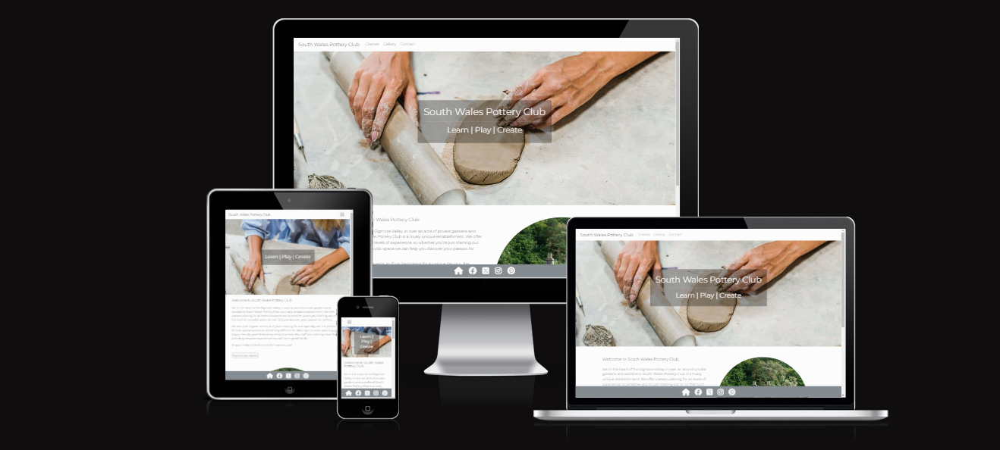
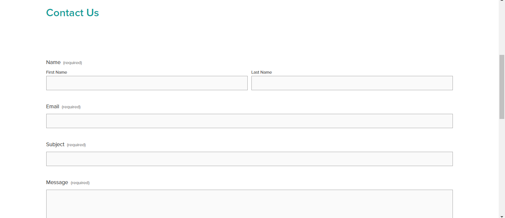

# South Wales Pottery Club

This is the website for South Wales Pottery Club, a hypothetical business in development. The site is the outcome of the Code Institute's milestone project one and designed primarily using html & CSS. Please find a link to the deployed project here:

[South Wales Pottery Club](https://annabelle-metcalfe.github.io/south-wales-pottery-club/index.html)

## Contents
* [UX - Strategy](#ux---strategy)
  * [Project Goals](#project-goals)
  * [Business Goals](#business-goals)
  * [Competitor Review](#competitor-review)
     * [Cardiff Pottery Workshop](#cardiff-pottery-workshops)
     * [Peggy's Pots](#peggys-pots)
     * [Stupots](#stupots)
  * [User Goals](#user-goals)
  * [User Stories](#user-stories)
* [UX - Scope](#ux---scope)
  * [Limitations Identified](#limitations-identified)
  * [Current Phase](#current-phase)
* [UX - Structure](#ux---structure)
  * [Sitemap](#sitemap)
* [UX - Skeleton Plane](#ux---skeleton-plane)
  * [Wireframes](#wirerames)
* [UX - Surface Plane](#ux---surface-plane)
  * [Design Choices](#design-choices)
   * [Colour Palette](#colour-pallette)
   * [Typography](#typography)
   * [Layout](#layout)
  * [Features](#current-features)
* [Testing](#testing)
* [Known Bugs](#known-bugs)
* [Deployment](#deployment)
* [Technologies Used](#technologies-used)
* [Acknowledgements](#acknowledgements)

## UX - Strategy 
### Project Goals

The goal of this project is to create a user-centric website for an up and coming pottery class business in South Wales.

The business has not yet begun trading so at this time they are looking to establish an online presence ahead of their launch. The project aims to identify the potential market for pottery classes by evaluating similar businesses and researching customer needs. 

The outcome of this project will target consumers appropriately and add value to their experience by utilising UX design principles. The site will be cleanly presented, easy to navigate and encourage enquires through clickable links. The user will also have easy access to all relevant information wihtout having to search through multiple pages. 

### Competitor Review

#### Cardiff Pottery Workshops 

 [Cardiff Pottery Workshops](https://www.cardiffpotteryworkshops.com) are a successful business based in Cardiff. They have  wide range of classes and membership options available including lessons, studio space for rent and social evenings.
 
  Although very informative, the website is not the most intuitive and seems to lack responsiveness when viewed on a larger screen. There is a lot of empty space when you first navigate to the home page and the menu sits in the middle of the screen, it not immediately obvious that there is more content on the page. The navigation menu is a long list of things they offer in no particular order which may cause issues with users not being able to find the appropriate content quickly. 

 Further down, they have links to different pages within the about section. These link to new pages with class descriptions, however on testing a number of the links don't work. Presenting the class descriptions in this way makes it quite challenging for the user, as it relies on them scrolling down to the appropriate section, reading the about section where you would not intuituvely look for class information, and then unable to find the information with broken links. 

The contact page doesn't respond to being on a larger screen, while not unusable it doesn't create the best UX experience as the input boxes seem disproportionately large for the amount of content they are designed to contain.

Lastly, the booking system is quite sporadic. Rather than having a dedicated booking section they have hidden the booking forms within the individual class pages. The personal tuition is at the bottom of the throwing classes page, which would not be where a user is likely to look for it.

While the site is comprehensive and contains a lot of useful information, it could be made more user friendly by better organising the information into relevant categories. Having a dedicated classes and booking page would rectify some of the navigation problems, while addressing some of the responsiveness issues would improve the user experience. 

#### Peggy's Pots

[Peggy's Pots](https://www.peggyspots.co.uk/Default.aspx) is another successful business based in Cardiff. They offer pottery painting experiences and parties for people of all ages, especially catering for families.

The website is easier to navigate than the Cardiff Pottery Workshop but could also be improved upon. The navigation menu again is quite a long list that could be better organised into categories and sits below the logo.

They have included a classes section on the home page, providing a clear overview of the different class types. Clicking on these leads to a dedicated class page with descriptions and what to expect. Further down they have testimonials, the subscribe form and address all sitting within the footer. There seems to be an issue with the form size making a lot of empty space next to it. The form could perhaps be moved to another section to avoid this. 

The site has been designed with Bootstrap so seems to avoid any issues with resizing, and in fact looks better on a smaller screen as there is less blank space. The contact and booking pages contain lots of information, while useful it is possibly too much text which could be moved elsewhere or edited. These pages could also potenially benefit from some adjustments to the layout as the containers seem to sit randomly across the screen on a larger screen. Overall it is a good basic site which is relatively easy to navigate, however it could be made more user friendly with some tweaking to the design and layout. 

#### Stupots 

[Stupots](https://www.stupots.co.uk/) is a pottery workshop based in Bristol. They offer a wide range of classes and experiences including corporate team building sessions.

The website is really nicely laid out and responsive. The navigation is organised into relevant categories and the logo sits nicely within the menu without being too big. They have used a video in place of a hero image on the home page which creates a welcoming experience. They have added a modal advising on extra spaces available in the taster sessions on the right of the screen which is a bit detrimental to the video, but does grab your attention. 

As you scroll down there is information on the highlighted experiences that they offer, testimonials, a scrolling gallery incorporating Javascript and finally a large footer which contains a lot of information inluding the address and contact information. It is well presented with interesting graphics, the layouts include images and descriptions defined into sections by different background colours and the descriptions are comprehensive without being too long. Each section includes a link to a dedicated page with more information encouraging clicks.

The booking and contact pages are also well laid out with well proportioned containers and are clean without too much information. The site is responsive and works well on both large and small screens. They've used a number of frameworks including Yoast SEO and seems to have been built on Wordpress. Overall this is a really user friendly website that looks professional and stands out as a good example from the research for this project.

### Business Goals

* To create an online presence for the business
* To attract customers and build membership
* To provide information on classes, contact information and the location of the studio

### User Goals

Based on the competitor research, a number of key features have been identified. Users of the site will be able to:

* Browse different classes and events
* Find class and event timetables
* Find the location of the studio
* Find contact information for the business
* View a gallery of the studio in action
* View information on the benefits of pottery for wellbeing

### User Stories

* User 1 is looking for new activities to do with the kids over the school holidays

* User 2 is looking for a new hobby and the opportunity to make new friends

* User 3 is an intermediate potter looking to improve their skills

* User 4 is looking for fun new date night ideas

* User 5 is looking for a unique experience gift for a loved one

* User 6 was referred by the local mental health team

## UX - Scope

### Limitations Identified 

It is not possible to implement all desired features at this stage for a number of reasons. The contact form will not be linked to a database without back-end development, and the gallery will be static as there will be no Javascript. There will also be limited pages due to time contraints and the assesment criteria required for the project.

I have used Bootstrap to enable a responsive menu in the design but chosen to limit the use of this framework in other areas of the site. The reason for this decision is that I wished to have a good understanding of CSS and did not want to always be reliant on Bootstrap to help with responsiveness. The outcome of this has been learning to 
successfully impliment CSS grids for layouts and media queries to enable responsiveness.

### Current Phase

* Build a functioning website to create an online presence for the business 
* Present different class types and information on what they are for
* Provide a means of contacting the business and a timetable 
* Showcase a gallery of photos to demonstrate how the studio might look

## UX - Structure

### Sitemap

**Navigation**

My initial plan was to create a dedicated classes page with further links to individual classes. However, after discussing this with my mentor it was decided at this stage to focus on a single class page. In the future, if I was to develop this site further I would revisit this plan, create dedicated class pages and add more detail to the class descriptions. I would also look again at creating an events page which would be periodically updated by the business.

**First draft site map**

**Revised site map**

## UX - Skeleton

### Wireframes

**Home Page**

Initially I planned to just have a hero image on the landing page with some information on the studio. Users would of had to use the navigation menu to access any other parts of the site. The revised version is much more user friendly and includes links to other pages directly from the about section.

**First draft home page**

**Revised home page**

**Classes Page**

In the first draft I intended to have a landing page for all the classes and then a dedicated page for each class. After discussing this with my mentor I decided to streamline the design to incorporate one classes page with short class descriptions. In the future if I was to develop this site further I would revisit the seperate class pages and include more detailed class descriptions.

**First draft classes page**

**Revised classes page**

**Gallery Page**

Initially I has planned to use Bootstrap to create the gallery which would of enabled the use of Javascript and provided more options with interactitvity. However as I moved away from Bootstrap I needed to find another solution and used CSS grids to create a static gallery.

**First draft gallery page** 

**Revised gallery page**

**Contact Page**

The contact page did not change an awful lot compared to the first draft, except I decided to include a timetable as well as the other components. I had some trouble with the layout which meant the timetable eventually had to go at the bottom of the page, I will discuss this further in the resolved bugs section.

**First draft contact page**

**Revised contact page**

## UX - Surface

### Design Choices 

#### Colour Pallette

Pottery is a relaxing and slow-paced activity so I chose to keep the colour palette neutral to ensure that none of the elements would be overpowering and to create a calm aesthetic. 

#### Typography

The font for the website is **Montserrat**, generated by Google Fonts. This was chosen due to being a clean contemporary font that gives the document a touch of sophistication. It is clear and easy to read without compromising on style.

#### Layout 

I chose to use a hero image on each page to keep the format consistent across the site. The exception is the gallery page, as I felt including a hero image would be unneccessary and possibly interfere with the user experience. 

#### Development

##### Home page

Initially, I had planned on having more pages and including a dropdown menu within the navigation bar for the individual class pages. However as previously mentioned after discussing this with my mentor it was decided to streamline the number of pages and concentrate on the key elements needed to achieve a functioning site.

I was planning to use an image as a link to the classes page but since learned this isn't great for accessibility thanks to my mentor. The plan then evolved to encorporate the about section on the home page rather than having a dedicated about page, therefore I changed the image to the picture of a house and included some text about the studio.

I decided to add some testimonials as there didn't feel like there was a whole lot on this page and it seemed to make sense to include them on the landing page where users would be very likely to see them. I also changed the styling of the footer to make it stand out better against the background.

#### Classes Page

This page was probably the most challenging of them all as I had quite a lot of trouble with the responsiveness.

## Features

### Current Features

Screenshots

* Home page with hero image
* Navitagion to:
  * About section
  * Classes
  * Gallery
  * Timetable
  * Contact
* Class sub navigation:
  * Children's classes page
  * Adult's begginner classes page
  * Adult's improver classes page
  * Wellbeing classes page
  * Events page
  
### Future Features

* Book classes online
* Purchase memberships online
* Create an online shop to sell student's work

## Testing

| Component | Expected Outcome | Test | Result |
| --- | --- | --- | --- |
| Navbar brand | Links to home page | Clicked logo | Pass |
| Navigation links | All links go to the correct page | Clicked on links | Pass |
| Footer icons | All links correct and open in new window | Clicked on icons | Pass |
| Explore classes button | Links to class page | Clicked on button | Pass |
| Contact us button | Links to contact page | Clicked on button | Pass |
| Enquire now links | Links to contact page | Clicked on link | Pass |
| Contact form | All input required | Filled out form | Pass |
| Contact form | Formdump working | Submit form | Pass |
| Google map | Shows correct place | Click on map | Pass |
| Responsiveness | Site works across all breakpoints | Google Dev tools | Pass |
| Lighthouse testing | Check accessibility | Run lighthouse | Pass |
| HTML Validator | Check for errors | Run validator | Pass |
| CSS Validator | Check for errors | Run validator | Pass |

### HTML Validation ###

I used W3C Markup Validation service and Jigsaw to ensure there are no errors in the html and CSS. 

On the initial test an error was found where I had used an <a> element as a decendent of a <button>. I tried swapping them around and came back with the same error. I had not realised that a button could not be used for a link before this. I removed the button and simply left the <a> element with the styling applied in CSS. It looks the same but now comes back with no error.

### CSS Validation ###

## Bugs Resolved

### Home Page

I was using Bootstrap at first which was causing there to be too many columns on the page. The heading was also sitting on the same line as the paragraph. I decided to move away from Bootstrap and looked at other ways of organising the layouts using CSS only. Inititally, I followed a tutorial which involved displaying the content as a table and using float/clear properties but I still felt there must be a better way. Eventually I changed it to display as a block and used column count, then applied a media query to enable responsiveness as this seemed like the smoothest solution. I could of also used a grid, but didn't feel it was particularly neccessary for just two components.

I had some initial trouble with the footer floating above the bottom of the page when I wanted it to be sticky. I eventually worked out it was due to the margin being set to something other than zero.

### Classes Page

On the classes page, I had a lot of difficulty getting the images to sit within the containers.I tried lots of different combinations to solve this, it was eventually solved by setting the object fit property to cover and setting the height and width of the images.

With the row height set to auto it displayed the whole image but I felt this looked untidy so decided to keep the row height consistent. I eventually decided on applying height of 50% to the images. 

There were some major problems with the responsiveness on the class page. It was not sitting in the centre and a lot of the content was spilling over the edge. It was resolved by removing the padding and margin from the grid. I then applied padding to the class description content instead so that it would not sit too close to the edge of the screen.

### Gallery Page

It was a bit challenging figuring out how to position the images on the gallery grid. Sometimes they were stretched or didn't fit where I had hoped to place them. I tried different layouts before deciding on the final draft. 

## Bugs Unresolved

## Technologies Used

* HTML
* CSS
* Git
* Github
* Codeanywhere/VS code/Gitpod
* Bootstrap
* Balsamiq
* Google Fonts
* Font Awesome
* GIMP

## Deployment

### How to run project locally

## Credits

### Content

[Am I Responsive](https://ui.dev/amiresponsive)

### Media

Map 

[Google Maps](https://www.google.com/maps/embed?pb=!1m18!1m12!1m3!1d19876.57543532705!2d-3.6157785047719218!3d51.4843713332673!2m3!1f0!2f0!3f0!3m2!1i1024!2i768!4f13.1!3m3!1m2!1s0x486e6da60f85f263%3A0x50d8b23d4977cb0!2sEwenny%2C%20Bridgend%20CF35%205BL!5e0!3m2!1sen!2suk!4v1704639927687!5m2!1sen!2suk)

Images

Many thanks to all the creators of the free stock images used to create this website. Links to the source for each image are available below:  
[Background Image Main](https://www.pexels.com/photo/person-holding-wooden-rolling-pin-7559748/) |
[Pot painting](https://pixabay.com/photos/hand-art-pot-master-man-handmade-5441435/) |
[Country house](https://pixabay.com/photos/country-house-villa-ingrown-lonely-5019947/) |
[Mum and Son](https://www.freepik.com/free-photo/mother-with-son-pottery-class_10705274.htm#query=pottery%20class&position=47&from_view=search&track=ais&uuid=15eefbbd-5591-44f1-a7ae-5bea9a06561a) |
[Children](https://www.freepik.com/free-photo/brothers-pottery-class-together_10703805.htm#query=pottery%20class&position=37&from_view=search&track=ais&uuid=15eefbbd-5591-44f1-a7ae-5bea9a06561a) |
[Couple](https://www.freepik.com/free-photo/mutual-creative-work-adult-elegant-couple-casual-clothes-aprons-people-creating-bowl-pottery-wheel-clay-studio_10164980.htm#query=pottery%20class%20couples&position=48&from_view=search&track=ais&uuid=b3ad02d6-f0d1-41af-a080-5162b03a9e45) |
[Pots on shelf](https://www.pexels.com/photo/pottery-on-a-wall-shelf-6615807/) |
[Workshop](https://www.pexels.com/photo/photo-of-ceramic-kitchenware-on-shelves-3094041/) |
[Plant pot](https://www.pexels.com/photo/photo-of-ceramic-kitchenware-on-shelves-3094041/) |
[Studio Class](https://www.pexels.com/photo/couple-creative-working-indoors-9733232/) |
[Cactus](https://www.freepik.com/free-photo/still-life-with-cactus-plant_44590359.htm#query=website%20background%20pots&position=14&from_view=search&track=ais&uuid=5241e72f-f9bc-465d-915b-89e26216952c) |
[Plate](https://www.freepik.com/free-photo/top-view-brown-plate-empty-light-blue-plate-food_10543301.htm#page=3&query=Website%20background%20pottery&position=21&from_view=search&track=ais&uuid=a6dbcc91-eeb2-4210-b3a3-0a365894d206) |
[Multi-coloured](https://pixabay.com/users/hans-2/?utm_source=link-attribution&utm_medium=referral&utm_campaign=image&utm_content=9367) |
[White jugs](https://pixabay.com/users/noname_13-2364555/?utm_source=link-attribution&utm_medium=referral&utm_campaign=image&utm_content=4465357) |
[Hanging Mugs](https://pixabay.com/users/publicdomainpictures-14/?utm_source=link-attribution&utm_medium=referral&utm_campaign=image&utm_content=21905) |
[Lady Sculpture](https://pixabay.com/users/disappearingdiamonds-3977653/?utm_source=link-attribution&utm_medium=referral&utm_campaign=image&utm_content=3394318) |
[Cats](https://pixabay.com/users/leoleobobeo-1487549/?utm_source=link-attribution&utm_medium=referral&utm_campaign=image&utm_content=2759936) |
[Student](https://www.pexels.com/photo/pottery-making-classes-15096491/) |
[Child](https://www.pexels.com/photo/girl-in-art-class-3965526/) |
[Happy pot](https://www.pexels.com/photo/green-leafy-plant-potted-on-clay-pot-993626/) |
[Men in Studio](https://www.freepik.com/free-photo/side-view-man-doing-pottery_31124478.htm#query=pottery%20class&position=7&from_view=keyword&track=ais&uuid=8218caed-1a9f-4aae-88af-c016115a128) |
[Random pots](https://www.freepik.com/free-photo/various-ceramic-vases-with-paint-pottery-concept_10267527.htm#page=3&query=ceramics%20colourful&position=33&from_view=search&track=ais&uuid=87aa8cf3-c79b-4126-bf35-7f4bef18996a) |
[Broken Plate](https://unsplash.com/photos/top-view-photography-of-broken-ceramic-plate-cGXdjyP6-NU)

### Code

[Rounded corners tutorial](https://unused-css.com/blog/css-rounded-table-corners/#:~:text=If%20you%20are%20only%20rounding,done%20with%20a%20box%2Dshadow%20.)

[Responsive background images with Bootstrap 5](https://www.youtube.com/watch?v=W87XNjvXiWw&t=178s)

[Bootstrap Navbar](https://getbootstrap.com/docs/4.0/components/navbar/)

[Autofit CSS Grids](https://www.youtube.com/watch?v=QO-vcJFRgOg)
