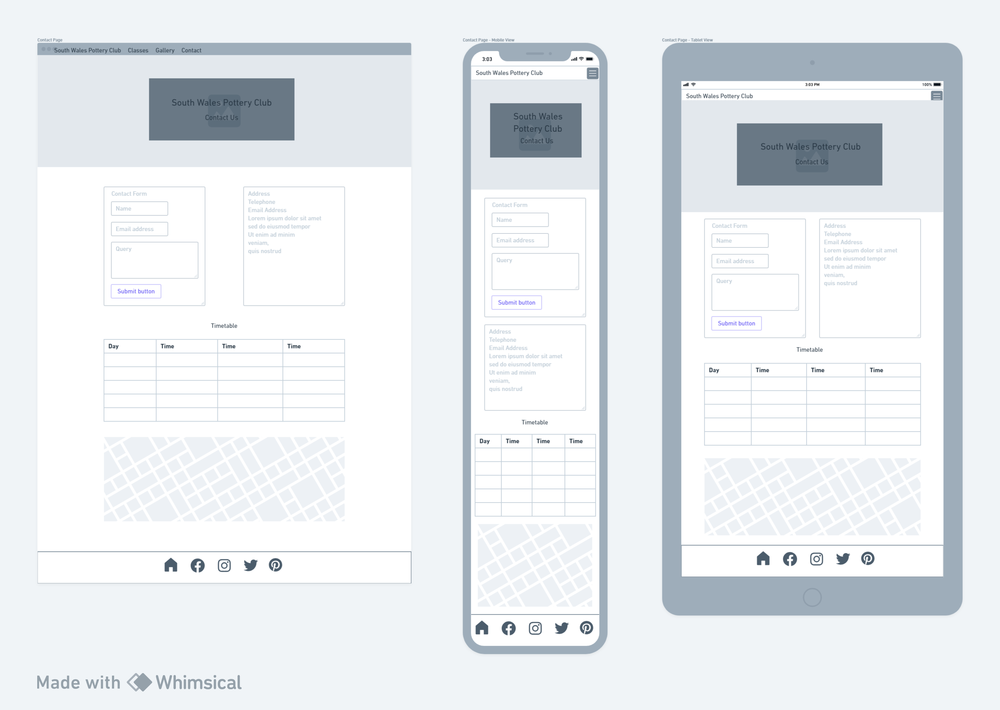

# South Wales Pottery Club

## UX

### Project Goals

* The goal of this project is to create a user-centric web site for an up and coming pottery business in South Wales.

### User Goals

Users of the site will be able to:

* Browse different classes and events
* Find class and event timetables
* Find the location of the classes
* Find contact information for the business
* View gallery of events and work
* View information on the benefits of pottery for wellbeing

### Business Goals

* To attract customers and build membership

### User Stories

* User 1 is looking for new activities to do with the kids over the school holidays

* User 2 is looking for a new hobby and the opportunity to make new friends

* User 3 is an intermediate potter looking to improve their skills

* User 4 is looking for fun new date night ideas

* User 5 is looking for a unique experience gift for a loved one

* User 6 was referred by the local mental health team

### Wireframes

Sitemap

Home Page

About Page

Classes Page

Gallery Page

Timetable Page

Contact Page

## Features

### Current Features

* Home page with hero image
* Navitagion to:
  * About section
  * Classes
  * Gallery
  * Timetable
  * Contact
* Class sub navigation:
  * Children's classes page
  * Adult's begginner classes page
  * Adult's improver classes page
  * Wellbeing classes page
  * Events page
  
### Future Features

* Book classes online
* Purchase memberships online
* Create an online shop to sell student's work

## Technologies Used

* HTML
* CSS
* Git
* Github
* Codeanywhere/VS code
* Bootstrap
* Balsamiq
* Google Fonts
* Font Awesome
* GIMP

## Testing

## Known Bugs

## Deployment

### How to run project locally

## Credits

### Content

### Media

images <https://www.pexels.com/photo/person-holding-wooden-rolling-pin-7559748/>

### Code

### Acknowledgements

Responsive background images with Bootstrap 5
<https://www.youtube.com/watch?v=W87XNjvXiWw&t=178s>
