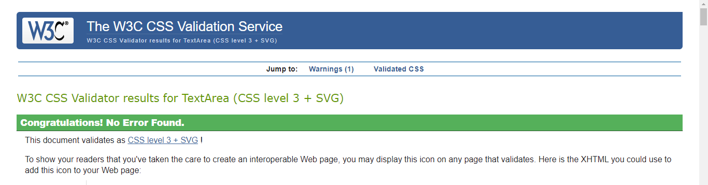

# South Wales Pottery Club

## Testing

### Contents

* [Manual Testing](#manual-testing-table)
* [Lighthouse Testing](#lighthouse-testing)
* [Responsiveness](#responsiveness)
* [HTML Validation](#html-validation)
* [CSS Validation](#css-validation)
* [Bugs Resolved](#bugs-resolved)
* [Bugs Unresolved](#bugs-unresolved)

### Manual Testing Table

| Component | Expected Outcome | Test | Result |
| --- | --- | --- | --- |
| Navbar brand | Links to home page | Clicked logo | Pass |
| Navigation links | All links go to the correct page | Clicked on links | Pass |
| Footer icons | All links correct and open in new window | Clicked on icons | Pass |
| Explore classes button | Links to class page | Clicked on button | Pass |
| Contact us button | Links to contact page | Clicked on button | Pass |
| Enquire now links | Links to contact page | Clicked on link | Pass |
| Contact form | All input required | Filled out form | Pass |
| Contact form | Formdump working | Submit form | Pass |
| Google map | Shows correct place | Click on map | Pass |
| Responsiveness | Site works across all breakpoints | Google Dev tools | Pass |
| Lighthouse testing | Check accessibility | Run lighthouse | Pass |
| HTML Validator | Check for errors | Run validator | Pass |
| CSS Validator | Check for errors | Run validator | Pass |

## Lighthouse Testing 

### Home Page

On the initial lighthouse test I had a number of findings to address. I had not yet added aria-labels to the images and also had not used `h1`, `h2` etc in chronoligical order. Fixing these issues improved both the accessibility and the SEO score.

When I added the testimonials I initially had the background set to the same colour as the footer but this was returning a contrast error. I tried changing the font to bolder but this looked strange compared to the rest of the website. I settled on making the backgrounds darker, although not ideal visually it did fix the contrast error.

The final lighthouse score for the home page is displayed below. I was able to improve the performance slightly by compressing the image files.

### Classes Page

The first lighthouse test for the class page came back with similar issues for the aria-labels and headings but the main issue was the performance as there are a lot of images on this page. I compressed the images unitl the score was satisfactory without compromising the quailty of the images.

Updated score

### Gallery Page

Again the gallery images were missing aria-labels, after these were added the score improved. I had already compressed the images as I was going along so the performance was at a level I was happy with for the number of images.

Updated score

### Contact Page

The contact page also had the same issues as pervious pages. The best practice score is slightly lower due to a cookie relating to the Google map.

Updated score 

### Responsiveness 

Responsiveness was checked both on Google Developer Tools and on [Am I Responsive](https://ui.dev/amiresponsive). Bugs encountered are discussed in the resolved bugs section.

### HTML Validation ###

I used W3C Markup Validation service and Jigsaw to ensure there are no errors in the HTML and CSS. 

On the initial W3C Validator test an error was found where I had used an `a` element as a decendent of a `button`. I tried swapping them around but it came back with the same error. I had not realised that a button could not be used for a link before this. I removed the button and simply left the `a` element with the styling applied in CSS. It looks the same and has the same functionality but now comes back with no error.

I had missed closing a `div` on a few of the pages. I added that in and that resolved the error.

The validator also found that I had mislabled the contact form. I eventually got rid of the lable altogether and used a `h3` element instead as it was more semantic.

There was also a stray `div` which I removed to resolve this error.

There are some warnings present on the contact page where I have applied aria-labels to the font awesome icons in lieu of titles. This did not show up on Lighthouse or Wave testing so I decided to leave them in. 

There are a number of info flags present in the validation. Most are relating to the metadata, code for external frameworks including Bootstrap and Google Fonts or comments that I have put in the code. These have been left in as they do not effect functionality.

### CSS Validation ###

The Jigsaw validator found an error where I had used an invalid value with the transform property. I changed the value from a percentage to a decimal which resolved the error.

The parse error was an unclosed media query near the end of the document. 

This warning was returned, but as it does not effect functionality it was left as is.

After fixing these errors the validator returned a result of no errors.

## Bugs Resolved

### Navbar 

When adjusting the screen size the `navbar-brand` was not fitting along with the rest of the menu, forcing it to split over two lines. I applied CSS `display: none` to the navbar-brand so that it does not display on small screens which solved this, however there was then no link to the index page on the navigation menu. I added an index page link to the menu and set that to be hidden on larger screens. This enabled full navigation across all screen sizes.

I wanted the hamburger menu to sit in the right hand side of the screen, but not the navbar brand. I applied `d-flex` to the nav items to enable this, however the navigation then became stuck open and due to time constraints I decided to change it back. This is something I may wish to look at again in the future if I revisit this project.

### Footer

I had some initial trouble with the footer floating above the bottom of the page when I wanted it to be sticky. I eventually worked out it was due to the `margin` being set to something other than zero.

### Home Page

I was using Bootstrap at first which was causing there to be too many columns on the page. The heading was also sitting on the same line as the paragraph. I decided to move away from Bootstrap and looked at other ways of organising the layouts using CSS only. Inititally, I followed a tutorial which involved displaying the content as a table and using float/clear properties but I still felt there must be a better way. Eventually I changed it to `display: block` and used `column-count` then applied a media query to enable responsiveness as this seemed like the smoothest solution. I could of also used a grid, but didn't feel it was particularly neccessary for just two components.

### Classes Page

When I started building the class page grid the class descriptions were sitting in their own grid area. I felt this could be improved upon as it wasn't immediately obvious the description and the image were connected. This was resolved by containing all the content of each class description in a `div` as only direct decendents become grid items.

Once I got the image and description to be contained as a single grid item I had a lot of difficulty getting the images to sit within the containers. I tried lots of different combinations to solve this, it was eventually solved by setting the `object-fit` property to `cover` and setting the height and width of the images.

Before I set the height and width of the images, with `grid-template-rows` set to `auto` it displayed the whole image but I felt this looked untidy. To keep the size of the rows consistent it was neccessary to set the height and width of the images. I eventually decided on applying height of 50% to the images as this worked best on all screen sizes.

There were some major problems with the responsiveness on the classes page. It was not sitting in the centre and a lot of the content was spilling over the edge. It was resolved by removing the `padding` and `margin` from the grid. I then applied padding to the class description content instead so that it would not sit too close to the edge of the screen.

### Gallery Page

It was a bit challenging figuring out how to position the images on the gallery grid. Sometimes they were stretched or didn't fit where I had hoped to place them. I tried different layouts before deciding on the final draft. 

To make the gallery responsive I used a media query to apply `display: block` and `column-count,` rather than designing a whole new grid as it seemed more efficient to do it this way. However, as it was no longer a grid the gap between the rows no longer applied so the images were all crammed together. I eventually discovered setting the images to have a `margin` resolved this.

### Contact Page

When building the contact page I tried to put the timetable within the grid which initially seemed to work. However, once testing the responsiveness it spilled out of the container and the grid did not resize as it was supposed to. I tried setting it to span across two columns but this was also ineffective. I eventually removed it from the grid entirely and placed it underneath. 

### After Deployment

When I deployed the project to Github Pages the background images disappeared. They were still visible locally, and all the other images were working so I knew there must be an issue with the CSS file. I looked on a number of forums where others had had the same issue and dicovered it was an issue with the filepath. Github Pages was not recognising the URL so I tweaked it a few times until the images appeared.

## Bugs Unresolved

When dropping down to a small screen the timetable heading does not sit directly above the timetable. I cannot find the reason for this, neither the timetable nor the heading seem to have any padding or margin set that would cause it to behave this way so this has remained unresolved.

